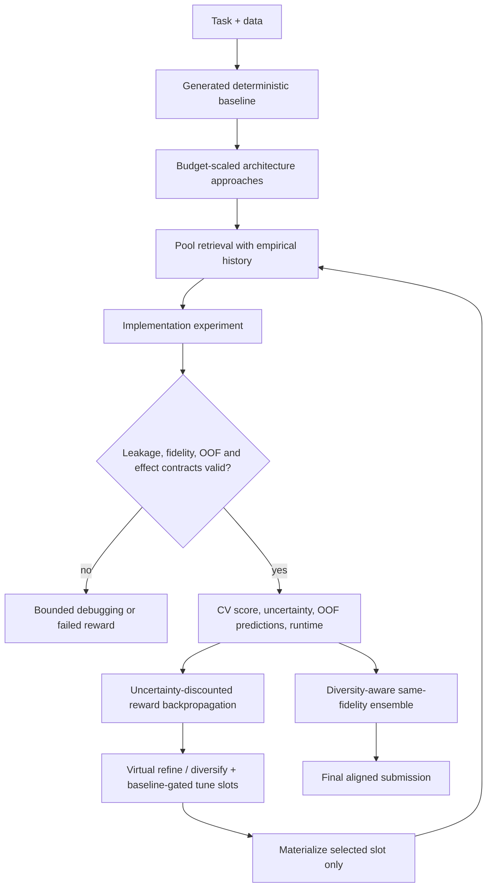

# Evidence-Driven AIBuildAI Agent

This repository is a tabular-ML research prototype inspired by AIBuildAI-2. It evolves multiple runnable solutions, evaluates them under an implementation-experiment budget, reuses empirically validated techniques, and produces a diversity-aware ensemble.

## What changed from the original prototype

- **True solution lineage:** follow-up experiments start from the measured parent `algorithm.py` and inherit reusable support files instead of restarting from the baseline.
- **Budget-aware branching:** initial fan-out is `min(3, max(1, budget // 3))`. Every success creates cheap virtual `refine` and `diversify` slots; a model-locked `tune` slot is added only when the uncertainty-adjusted score beats the baseline.
- **Experiment-based budgets:** only attempted implementation runs consume `--budget`; technique planning does not.
- **Harness-owned evaluation:** deterministic row subsets and folds enforce `screen`, `medium`, and `full` fidelity. Full fidelity restores loader-held validation rows instead of silently training on only 80% of the data.
- **Validation safeguards:** generated code is checked for leakage, and the harness recomputes fold scores and uncertainty from aligned OOF predictions.
- **Empirical memory:** bounded pool retrieval ranks scope-compatible artifacts with lexical fit, prior reward, improvement rate, and a UCB-style exploration bonus.
- **Feasibility-aware execution:** declared accelerator, RAM, and allowlisted dependencies are checked before execution. Runtime estimates are informational. If an optional artifact cannot be installed, ordinary branches attempt a dependency-light equivalent; model-locked tuning nodes are safely skipped.
- **GPU-preferred nodes:** CUDA is selected ahead of MPS and CPU when available, propagated into every node subprocess, and used by compatible pool artifacts with a safe CPU fallback.
- **Reliable neural execution:** neural artifacts are verified against mixed-type data with missing values and use fold-local imputation/encoding, `float32` mini-batches, early stopping, device-safe prediction, and CPU retry paths.
- **Failure-focused repair:** each failed implementation can receive `max_debug_attempts` deterministic repairs after it exits; implementation nodes have no inactivity or wall-clock timeout, and failed attempts retain their own logs.
- **Winner fine-tuning:** a qualifying node is tuned as a separate experiment while preserving its model/artifact, preprocessing, features, and folds. Trial counts and selected hyperparameters are validated against fidelity caps.
- **Effect-aware execution:** descendants with byte-identical parent OOF and test predictions are marked `no_effect`, penalized, deduplicated on disk, and prevented from spawning more branches.
- **Diversity-aware aggregation:** candidates at the best completed fidelity are filtered by prediction correlation and combined with rank averaging. OOF files enable deterministic hill-climbed weights.
- **Review-gated harness evolution:** completed traces can generate offline prompt/control-flow proposals without automatically rewriting the live harness.

## Search workflow



The budget unit is one attempted implementation experiment. A default budget of six therefore runs up to six ML pipelines; it is no longer split between technique and implementation nodes.

## Configuration

Each task may define `tasks/<task_name>/task_config.json`:

```json
{
  "metric_name": "roc_auc",
  "metric_direction": "maximize",
  "subprocess_timeout": 300,
  "max_debug_attempts": 2,
  "max_fine_tune_rounds": 2,
  "enable_multi_fidelity": true,
  "ensemble_top_k": 3,
  "ensemble_strategy": "rank_average",
  "uncertainty_weight": 1.0,
  "max_l1_categories": 8,
  "max_artifact_candidates": 5,
  "resource_limits": {
    "preferred_accelerator": "auto",
    "max_ram_gb": 32
  }
}
```

`preferred_accelerator` accepts `auto`, `gpu`, `cuda`, `mps`, or `cpu`. `auto`/`gpu` choose
CUDA first, then Apple MPS, then CPU. An optional `accelerators` list restricts
the detected devices but never fabricates an unavailable device. Each node receives
the selection through `AIBUILDAI_ACCELERATOR` and records it in
`execution_resource.json`; successful node results also report the backend actually
used. Accelerator availability is re-probed in the selected project interpreter after
node dependencies are installed, so a newly installed PyTorch backend can expose
CUDA/MPS before execution. CatBoost, XGBoost, LightGBM, and PyTorch pool artifacts
enable their native backend when compatible and retry on CPU if the installed package
lacks GPU support. `max_ram_gb` is a cap on detected memory, so the example is sized
for a 32 GB worker without overstating smaller machines.

`subprocess_timeout` applies to the generated comparison baseline only. Search-tree
implementation nodes have no inactivity or wall-clock subprocess limit, allowing
long-running GPU training to finish. All debug attempts still count as one
implementation experiment.
`max_debug_attempts` controls the number of repairs after the first run.
`max_fine_tune_rounds` bounds successive winner-tuning experiments along a lineage.
The `screen`, `medium`, and `full` profiles cap tuning trials, epochs, early-stopping
patience, and estimator iterations in addition to their data and fold limits.

Configure a built-in provider:

```bash
export LLM_PROVIDER="nvidia"
export NVIDIA_API_KEY="..."
# or
export LLM_PROVIDER="gemini"
export GEMINI_API_KEY="..."
# or
export LLM_PROVIDER="openai"
export OPENAI_API_KEY="..."
export LLM_MODEL="your-openai-model"
```

Any provider exposing an OpenAI-compatible chat-completions endpoint can be used:

```bash
export LLM_PROVIDER="my-provider"
export LLM_API_KEY="..."
export LLM_BASE_URL="https://provider.example/v1"
export LLM_MODEL="provider/model-name"
```

Instead of `LLM_API_KEY`, provider-specific variables such as
`MY_PROVIDER_API_KEY` are accepted. Local vLLM/Ollama-compatible endpoints can set
`LLM_ALLOW_NO_API_KEY=1`. See the architecture guide for optional headers and
request controls.

## Run

```bash
python3 -m venv .venv
source .venv/bin/activate
pip install -r requirements.txt

python eval/run_ablation.py playground-series-s6e2 --budget 6
```

Rerunning the same condition moves the previous condition directory under
`runs/<task>/archive/` before writing new node artifacts. Every selected artifact,
including verified memory-pool hits and web-derived candidates, resolves its declared
dependencies through `requirements.txt`. The setup step installs the exact
project-controlled requirement when it is missing or the installed version does not
satisfy the pin, uses pip without a download cache, and validates the import. It will
not begin installation with less than 1 GiB free. An installation/provider failure
preserves ordinary branch intent as a self-contained implementation instead of
exhausting the tree; model-locked tuning remains a free setup skip.

The generated loader contract supports both `MyDataLoader()()` and immediate
`get_data()`, and exposes complete training rows plus stable row identifiers. The local
`evaluation_contract.py` deterministically creates the required data subset and folds.
If the initial baseline still crashes, times out, emits an invalid score,
or omits its submission, the harness records `baseline_debug.log` and gives
`InitialAgent` up to two deterministic repair attempts before stopping.

The command creates:

- `runs/<task>/baseline/`: the deterministic comparison baseline.
- `runs/<task>/complete_system/node_<n>/`: code, technique records, results, optional OOF predictions, and submissions for every node.
- Per-node `execution_resource.json`: selected/available accelerators and fallback policy.
- Per-node `attempt_<n>.log` and final `error.log`: bounded execution/debug diagnostics.
- Per-node `artifact_repair.json`: verification outcome and code hash when a failing copied neural artifact is repaired locally. Variant scores remain node-local and are not credited to the unchanged global pool card.
- Per-node `fine_tuning.json`: trigger context, chosen hyperparameters, trial count, score, and fidelity for successful fine-tuning runs.
- Per-node `evaluation_manifest.json` and `fold_assignments.csv`: enforced row/fold protocol.
- `tree_state.json` and `method_tree.png`: durable search state and visualization.
- `search_trace.jsonl`: frontier scores, exploration constant, selections, skips, no-effect decisions, and completed rewards.
- `ensemble_manifest.json`: selected same-fidelity ensemble members.
- `submission.csv`: final schema-aligned predictions.
- `eval/results.md`: score, normalized improvement, experiment count, fidelity, token, pool, and overcome metrics.
- `runs/<task>/token_usage.json`: aggregate and per-call input/output token usage, prompt sizes, and latency.

## Optional offline harness evolution

After collecting completed runs across several tasks and seeds:

```bash
python eval/evolve_harness.py \
  runs/task_a/complete_system \
  runs/task_b/complete_system \
  --output eval/harness_candidates.json
```

This produces review-gated candidate changes. It intentionally does not edit prompts or control flow automatically; candidates should be accepted only after held-out multi-task evaluation.

## Tests

```bash
python -m unittest tests.test_core_safety
```

Artifact verification uses a dedicated writable directory, process resource limits, and
`sandbox-exec` when the host permits it. This remains a compatibility check—not a
portable operating-system security boundary. `contract-mock-data` verification checks
output alignment and finiteness; declared neural classifiers additionally receive
mixed/missing inputs, unseen categories, all-empty numeric columns, singleton final
batches where the interface exposes batch sizing, and string-valued binary targets. Sandbox verification remains separate from
real-task validation history.

See [ARCHITECTURE.md](ARCHITECTURE.md) for the complete contracts and scheduling details.
