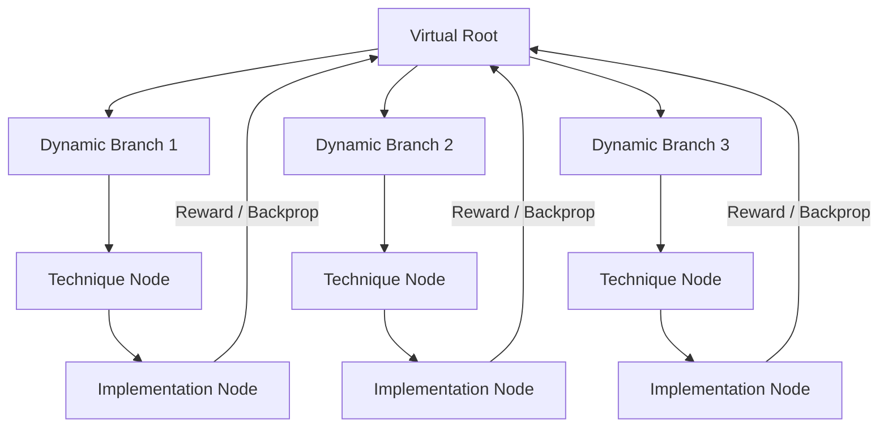

# Memory-Pool-Augmented Tree-Search Agent for Automated ML

This repository implements a research prototype extending the single-agent ML builder by adding:
1. **A Global Memory Pool (L1/L2)**: A catalog of verified machine learning utilities (encoders, preprocessors, models, stackers) that agents import directly.
2. **A 3-way Branching Tree Search**: Alternate Technique (Red) and Implementation (Black) nodes scheduled via UCB1.

---

## Architecture Overview



### Components

- `memory_pool/`: Contains `l1_index.json` (categories description) and the `l2_store/` (Model Cards + code).
- `memory_pool/builder/sandbox_verifier.py`: Generates synthetic tabular datasets and executes code in a credential-scrubbed subprocess. This is a compatibility check, not an OS security boundary. Upon success, it updates Model Cards with `verification_level = "shape-only-mock-data"` and writes path-redacted stdout/stderr to `verification_log`.
- `memory_pool/query_tool.py`: Allows agents to query category list summaries (`query(k)`) and drill down to get full code for imports (`query(k, j)`).
- `tree/scheduler.py`: A UCB1 multi-armed bandit scheduler that decays the exploration constant $c_t$ over time.
- `tree/global_memory.py`: Tracks sibling execution history and parent context $M_v$ for cross-node context-retrieval.
- `agents/`: Manager, Setup, Technique, and Implementation agents.
  - **Robust Execution (Watchdog)**: The Implementation Agent uses the task's configured `subprocess_timeout` as its absolute ceiling, with an inactivity ceiling no longer than 1200 seconds.
  - **Self-Documenting Debugging**: When recovering from crashes, the debugging agent prepends a comment block explaining the error and fix to the top of the corrected script.
- `requirements.txt`: Unified python dependency file for the entire agent system.

---

## Baseline vs Complete System

`eval/run_ablation.py` intentionally runs only the two conditions needed for the final comparison:

| Condition | Description |
|---|---|
| Baseline | One deterministic generated baseline execution |
| Complete system | Memory pool, web bootstrapping, and tree search enabled |

---

## Running the Ablation

1. Set up the virtual environment:
   ```bash
   python3 -m venv .venv
   source .venv/bin/activate
   pip install -r requirements.txt
   ```
2. Run the comparison on a specific competition (e.g. `tabular-playground-series-may-2022` or `playground-series-s6e2`):
   ```bash
   python eval/run_ablation.py tabular-playground-series-may-2022
   ```
   The task name is required unless `AIBUILDAI_TASK` is set. Use `--budget N` to set the complete-system node-execution budget. The command writes only `runs/<task>/baseline/` and `runs/<task>/complete_system/`; it does not run the three intermediate ablation variants. Configure the provider with `NVIDIA_API_KEY` or `GEMINI_API_KEY`; set `LLM_PROVIDER=nvidia|gemini` when both keys exist, and optionally set `LLM_MODEL` to override its default model.
3. View the results table in `eval/results.md`.
