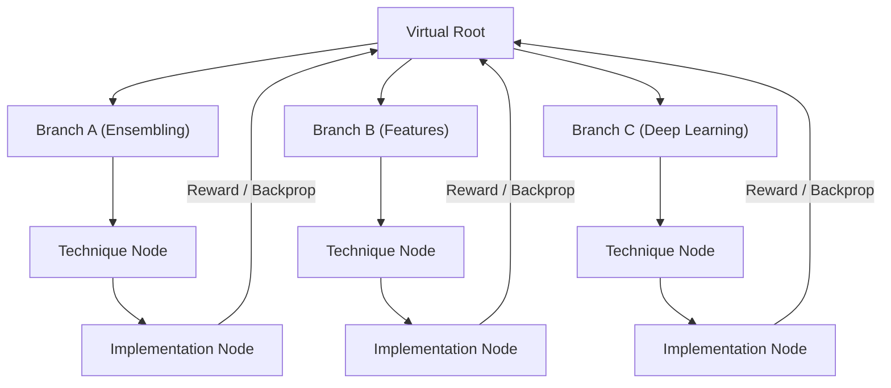

# Memory-Pool-Augmented Tree-Search Agent for Automated Tabular ML

This repository implements a research prototype extending the single-agent ML builder by adding:
1. **A Global Memory Pool (L1/L2)**: A catalog of verified machine learning utilities (encoders, preprocessors, models, stackers) that agents import directly.
2. **A 3-way Branching Tree Search**: Alternate Technique (Red) and Implementation (Black) nodes scheduled via UCB1.

---

## Architecture Overview



### Components

- `memory_pool/`: Contains `l1_index.json` (categories description) and the `l2_store/` (Model Cards + code).
- `memory_pool/builder/sandbox_verifier.py`: Generates synthetic tabular datasets and executes code in an isolated subprocess to verify correct output shapes and types before committing them to the pool.
- `memory_pool/query_tool.py`: Allows agents to query category list summaries (`query(k)`) and drill down to get full code for imports (`query(k, j)`).
- `tree/scheduler.py`: A UCB1 multi-armed bandit scheduler that decays the exploration constant $c_t$ over time.
- `tree/global_memory.py`: Tracks sibling execution history and parent context $M_v$ for cross-node context-retrieval.
- `agents/`: Manager, Setup, Technique, and Implementation agents.

---

## 2x2 Ablation Matrix

Evaluate the system performance and token efficiency using `eval/run_ablation.py`:

| Condition | Medal Rate | Gold Rate | Avg tokens/node | Pool-hit-rate | Overcome Rate |
|---|---|---|---|---|---|
| No-pool, single-agent | - | - | - | n/a | - |
| No-pool, tree-search | - | - | - | n/a | - |
| Pool, single-agent | - | - | - | - | - |
| Pool, tree-search (full) | - | - | - | - | - |

---

## Running the Ablation

1. Set up the virtual environment:
   ```bash
   python3 -m venv .venv
   source .venv/bin/activate
   pip install -r DataMaster-main/requirements.txt
   ```
2. Run the ablation harness on a specific competition (e.g. `tabular-playground-series-may-2022`):
   ```bash
   python eval/run_ablation.py tabular-playground-series-may-2022
   ```
3. View the results table in `eval/results.md`.
