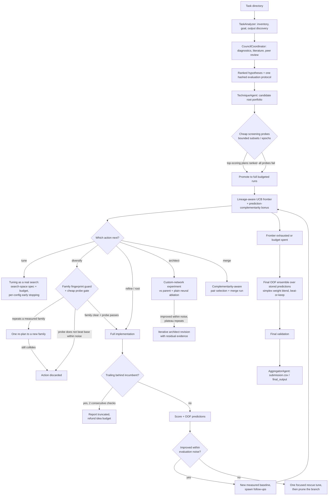

# AIBuildAI

AIBuildAI inspects a task directory, asks an LLM to write direct implementations
for the observed data, executes and repairs them, and keeps the best locally
scored deliverable. The search is modality-adaptive, but it requires a locally
measurable scalar objective to rank nodes; it is not a universal executor for
tasks whose quality cannot be evaluated locally.

## Workflow

1. `TaskAnalyzer` recursively inventories the task's files and folders. For
   common table/JSON formats it records bounded samples, counts, columns, and
   keys. It also reads supplied task instructions and identifies the requested
   output/sample-submission shape.
2. Before the tree starts, `CouncilCoordinator` runs a bounded local preflight,
   blocks likely held-out answer artifacts, and creates a de-identified problem
   fingerprint. It then assigns 2–5 evidence-gap-specific senior-engineer
   mandates, runs focused sandboxed diagnostic scripts, performs several precise
   primary-literature searches, and collects independent proposals.
3. An adversarial peer review challenges every proposal. The chair produces a
   Pareto-ranked hypothesis portfolio and one hashed evaluation protocol. If the
   LLM or research service is unavailable, a degraded evidence-compatible brief
   is still produced so the tree can continue.
   When multiple predictive modalities are detected, the council reserves a
   modality-contribution hypothesis instead of assuming full fusion is necessary.
4. `TechniqueAgent` converts the selected hypotheses into initial roots and
   prepends the globally strongest measured diagnostic control. Diagnostic
   controls are ranked by the task metric direction, so report order or model
   complexity cannot displace a better measured baseline. Cheap, budget-free
   screening probes run first (bounded subsets/epochs). For a council-selected
   portfolio, probe scores determine execution order and only the strongest
   bounded set is promoted by default. This keeps full training focused while
   preserving controlled family coverage; an opt-in environment switch can run
   every council-selected root when exhaustive coverage is desired.
5. Each root, tuning, architecture, merge, or recovery proposal is stored as a planning node;
   its following numbered child is the implementation node.
6. `ImplementationAgent` writes one self-contained `algorithm.py` per
   implementation node. Only council-approved task files are exposed under
   `input/`. Centrally auditable numeric table tasks retain aligned OOF/test
   prediction evidence and defer their deliverable; other tasks write their
   native artifact under `submission/`.
7. Every native deliverable passes a format-adaptive validator before its score is
   accepted, while deferred numeric candidates pass central prediction-evidence
   validation. Supplied sample outputs define structure; otherwise arbitrary
   non-empty files or directory bundles are accepted, with safe semantic checks
   for recognized formats. Validation failures enter the repair loop.
8. A score is rankable only when `result.json` reports the exact council protocol
   hash, task metric/direction, positive validation count, and the required number
   of finite fold scores. Contract failures also enter the repair loop.
9. A failed execution is repaired from its real code and stdout/stderr. Stale
   deliverables are removed between attempts, documentation search is available
   during repair, and transient provider responses are retried with backoff.
   Focused council diagnostics use the same bounded repair principle: AST
   rejection, runtime failure, or invalid JSON is fed back into up to three
   task-scoped repair attempts by default.
10. `ManagerAgent` uses a lineage-aware UCB frontier over lazy `refine`, `tune`,
    and `diversify` planning nodes. Every "is this an improvement?" decision is
    evaluation-noise aware: fold-score dispersion, then repeated-seed dispersion,
    then a conservative relative floor are used as the margin that a candidate
    must beat. It separately tracks measured architecture
    families and detects plateaus using a configurable material-gain tolerance,
    rather than exact score equality. Before another merge or early finalization,
    a plateau with no custom-neural evidence triggers one dedicated `architect`
    experiment when at least three idea slots were supplied. The strongest runnable node becomes the
    baseline. A displaced root receives one model-locked rescue tune and is
    pruned if it remains weak. Any later underperforming refinement, diversity,
    or merge candidate also receives one focused rescue tune before pruning.
    Improving descendants receive new actions; stale ancestors do not expand.
    Root, recovery, refinement, diversity, architecture, and merge implementations consume the
    configured new-idea budget. Tuning does not consume an idea slot, but a
    separate exploitation quota and depth/attempt limits bound its real compute.
    The strongest two measured configurations receive focused tuning before more
    architecture-family expansion.
11. Model-family diversity is a hard constraint: every plan is fingerprinted
    with the model family it proposes, and a `diversify` proposal that repeats
    an already measured family is sent back to the planner once before being
    discarded. A passing `diversify` proposal must also clear a cheap probe
    (its bounded run must beat the base within evaluation noise) before the
    full run is started. Every implementation node stores the fingerprint in
    its node config so resumed searches retain the constraint.
12. Long-running iterative implementations receive an abort contract: they
    checkpoint periodically and may report `status: "truncated"` with an honest
    score when they fall behind the incumbent by at least `2x` its evaluation
    noise for two consecutive checks. Truncated runs refund their idea budget,
    so early-aborting a losing run always saves a full idea slot.
13. An `architect` node derives a compact computation graph from observed data
    geometry and resource evidence. Its implementation must use a custom PyTorch
    `nn.Module`, compare against the measured parent and a plain neural ablation,
    and cannot silently substitute another tree library or named tabular network.
    The architect loop is iterative: when a completed custom-network run improves
    its control within noise and the plateau triggers again, the manager queues
    a second `architect` experiment seeded with the residual evidence, up to
    `AIBUILDAI_MAX_ARCHITECT_ITERATIONS` iterations.
    The system treats novelty as a testable hypothesis and does not claim that a
    generated design is unprecedented without prior-art evidence.
14. A multimodal contribution experiment compares full fusion, credible models
    for each modality alone, and every leave-one-modality-out variant on identical
    validation indices. The smallest modality subset within validation uncertainty
    of the best score is preferred, so a single modality may legitimately win.
15. Two competitive, independent lineages may be merged during the search. Both
    measured parent implementations are supplied to the merge, and an improving
    merge becomes the new baseline. Merge pairs are chosen by score and by
    prediction complementarity: stored OOF signatures with low pairwise
    correlation are preferred, so merges blend genuinely different signal.
16. Pending frontier actions whose measured parent is decorrelated with the
    incumbent best receive a complementarity bonus, steering remaining budget
    toward new signal rather than more of the same representation.
17. Supervised candidates may store a capability-gated prediction bundle with
    OOF predictions, their exact targets/indices/fold IDs, and aligned test
    predictions. For unambiguous built-in metrics, the manager recomputes the
    score from that bundle and replaces inconsistent self-reported scores.
    Task-native metrics and structured outputs remain under their declared evaluator.
18. Before finalization, two or more unique, compatible prediction bundles enter
    a deterministic cross-fitted blend. Search-pruned models remain ensemble-eligible,
    duplicate predictions are removed, weights are regularized and must be non-trivial,
    and the blend is used when it remains within an uncertainty-scaled robustness
    tolerance of the strongest honest candidate.
19. Eligible candidate nodes defer numeric CSV/TSV construction. The selected prediction
    strategy is materialized and validated once at the run root; intermediate node
    deliverables are removed after the final copy. Non-composable task-native outputs
    retain the existing validated single-output fallback.
20. On `--resume`, the persisted council brief is restored (including measured
    baselines, with migration for older schema-v1 artifacts) and the tree is
    audited for selected hypothesis IDs that never reached a full implementation
    node. The audit is reported; missing full attempts are scheduled only when
    `AIBUILDAI_REQUIRE_ALL_COUNCIL_ROOTS=1` disables the default exploration quota.

Manager, planner, implementation-attempt, generated-program stdout/stderr,
tuning, pruning, merging, promotion, web-repair, and finalization progress are
printed live with node names and timestamps.

The council adapts its measurements and member mandates to the observed task; it
does not select from modality-specific analysis templates. Generated diagnostic
scripts pass an AST mutation/import safety gate, run with scrubbed credentials
and network proxies, see only approved inputs, and must emit bounded structured
evidence. Bounded inputs are copied read-only; larger collections use allowlisted
links to avoid multiplying benchmark storage.
The generated implementation still owns task-native training and output
construction, but every search node shares the council's validation contract.

## Task and output portability

The inventory and implementation layers do not require classification or CSV.
They support tabular, image, text/sequence, audio, mixed-modality, and unknown
file collections; evaluation can be cross-validation, holdout, or task-native.
Outputs can be files or directory bundles. CSV/TSV, JSON/JSONL, NumPy, images,
archives, and common scientific text formats receive built-in checks.

Two boundaries are intentionally explicit:

- Search requires a finite scalar score with a known direction. For generation,
  simulation, control, retrieval, structure construction, or optimization, the
  supplied instructions/configuration must define a deterministic task-native
  evaluator or measurable proxy. Otherwise the analyzer emits a contract warning
  and reliable method ranking is not possible.
- Unknown output formats are safety- and structure-checked, but domain semantics
  cannot be inferred from a file extension. Supply a sample output and preferably
  a `task_config.json` `output_contract`; register a domain validator when semantic
  correctness (for example molecular/protein structure validity) must be proven.

## Council artifacts and LLM context

The JSON/JSONL files under `runs/<task>/council/` are an audit ledger, not a prompt
bundle. Council construction uses each artifact only at the stage that needs it:
preflight for member design, focused diagnostic plus relevant sources for each
member, and member summaries/source index for the one-time chair synthesis.

Downstream node calls never ingest every council artifact. They use valid-JSON,
role-scoped views generated from `council_brief.json`:

- search/ideation receives at most 6,000 characters containing the immutable
  protocol, compact problem fingerprint, measured baselines, selected IDs, and
  unresolved questions;
- implementation receives at most 6,000 characters containing the active
  hypothesis, its cited evidence/source claims, the protocol, and measured controls.

Large unrelated evidence, full retrieved paper text, member reports, query audit,
and research JSONL ledgers are excluded from per-node prompts. Context degradation
removes optional sections while retaining valid JSON and the protocol hash; it
never slices a JSON document mid-object.

## How the search flows


```mermaid
flowchart TD
    Start[Task directory] --> Analyze[TaskAnalyzer: inventory, goal, output discovery]
    Analyze --> Council[CouncilCoordinator: diagnostics, literature, peer review]
    Council --> Brief[Ranked hypotheses + one hashed evaluation protocol]
    Brief --> Plans[TechniqueAgent: candidate root portfolio]
    Plans --> Probing{"Cheap screening probes\nbounded subsets / epochs"}
    Probing -->|top-scoring plans ranked| Promote[Promote to full budgeted runs]
    Probing -->|all probes fail| Promote

    Promote --> Frontier["Lineage-aware UCB frontier\n+ prediction-complementarity bonus"]
    Frontier --> Decide{Which action next?}

    Decide -->|tune| Tuning["Tuning as a real search:\nsearch-space spec + budget,\nper-config early stopping"]
    Decide -->|diversify| Diversify{"Family fingerprint guard\n+ cheap probe gate"}
    Diversify -->|repeats a measured family| Replan[One re-plan to a new family]
    Replan -->|still collides| Discard[Action discarded]
    Diversify -->|probe does not beat base within noise| Discard
    Diversify -->|family clear + probe passes| FullRun[Full implementation]
    Decide -->|refine / root| FullRun
    Decide -->|architect| Architect["Custom-network experiment\nvs parent + plain neural ablation"]
    Architect -->|improved within noise,\nplateau repeats| Iterate["Iterative architect revision\nwith residual evidence"]
    Decide -->|merge| Merge["Complementarity-aware\npair selection + merge run"]

    FullRun --> EarlyAbort{Trailing behind incumbent?}
    EarlyAbort -->|yes, 2 consecutive checks| Truncate["Report truncated,\nrefund idea budget"]
    EarlyAbort -->|no| Measure[Score + OOF predictions]
    Measure --> Better{"Improved within\nevaluation noise?"}
    Better -->|yes| Baseline["New measured baseline,\nspawn follow-ups"]
    Better -->|no| Rescue["One focused rescue tune,\nthen prune the branch"]
    Baseline --> Frontier

    Frontier --> Done[Frontier exhausted or budget spent]
    Done --> Ensemble["Final OOF ensemble over stored predictions\nsimplex weight blend, beat-or-keep"]
    Ensemble --> Validate[Final validation]
    Validate --> Output[AggregatorAgent: submission.csv / final_output]
```

## Run

```bash
python eval/run_search.py playground-series-s6e2 --budget 6
```

`--budget 6` funds six successfully scored new root/branch ideas. Tuning does
not decrement that budget; failed implementations also preserve it.

Configure any OpenAI-compatible provider through the environment, for example:

```bash
export LLM_PROVIDER=openai
export OPENAI_API_KEY=your-key
export LLM_MODEL=your-model
```

The council, its literature research, and its generated diagnostic investigations
are enabled by default. Set `AIBUILDAI_COUNCIL=0` to bypass the whole layer,
`AIBUILDAI_COUNCIL_WEB=0` for local-only council analysis, or
`AIBUILDAI_COUNCIL_DIAGNOSTICS=0` to skip generated diagnostic scripts.
Web-assisted implementation repair is separately controlled by
`AIBUILDAI_WEB_SEARCH=0`. `LLM_MAX_RETRIES` and `LLM_TIMEOUT_SECONDS` control
provider recovery. Providers without `json_schema` response-format support are
detected automatically and use a schema-visible JSON fallback; set
`LLM_USE_JSON_SCHEMA=0` to skip the initial capability probe explicitly. The
capability result is remembered on disk (`~/.aibuildai/llm_capabilities.json`,
overridable with `AIBUILDAI_LLM_CAPABILITY_CACHE`) so every new run skips the
double-send for providers that reject structured output.

When an NVIDIA GPU is physically present but the child interpreter's torch
cannot use it (for example a capability-6.0 Tesla P100 under a newer build),
the agent re-pins a compatible torch automatically before falling back to CPU:
Pascal-class GPUs get `torch==2.6.0+cu126` from the CUDA 12.6 index, and the
capability probe performs a real CUDA allocation so warnings alone cannot hide
an unusable device. Set `AIBUILDAI_GPU_UPGRADE=0` to disable the reinstall and
always run on CPU; `AIBUILDAI_GPU_UPGRADE_INDEX` overrides the wheel index.

Architecture coverage is enabled by default. Set
`AIBUILDAI_ARCHITECTURE_EXPLORATION=0` to disable the reserved custom-network
experiment. `AIBUILDAI_ARCHITECTURE_MIN_BUDGET` controls its minimum idea budget
(default `3`), while `AIBUILDAI_PLATEAU_PATIENCE` and
`AIBUILDAI_PLATEAU_RELATIVE_GAIN` control saturation detection (defaults `1` and
`0.0005`). `AIBUILDAI_MAX_ARCHITECT_ITERATIONS` bounds the iterative architect
revision loop (default `2`). These settings affect when an architecture
experiment is required; they do not preselect a network template.

The supervised-search mechanics are task-type agnostic and degrade gracefully
when a task has no labeled validation set, fold scores, or repeated seeds:

- `AIBUILDAI_PROBE_MULTIPLIER` — probe capacity as a multiple of the idea budget
  (default `2.0`). Probes are cheap bounding runs that never charge the budget.
- `AIBUILDAI_IMPROVEMENT_NOISE_K` — how many noise standard deviations a
  candidate must beat to count as an improvement (default `0.35`).
- `AIBUILDAI_ABORT_ITERATIVE=0` disables early-aborting of losing iterative runs
  (enabled by default); `AIBUILDAI_ABORT_MARGIN_STD` sets the trailing margin in
  noise standard deviations (default `2.0`).
- `AIBUILDAI_COMPLEMENTARITY_WEIGHT` — how strongly decorrelated (vs. the
  incumbent) pending branches are favored (default `0.4`); `0` disables it.
- `AIBUILDAI_UCB_EXPLORATION` — residual frontier exploration after probe ranking
  and focused exploitation (default `0.35`).
- `AIBUILDAI_DIVERSIFY_PROBE=0` disables the cheap-probe gate before full
  `diversify` runs (enabled by default). The model-family fingerprint guard is
  always on.
- `AIBUILDAI_FINAL_ENSEMBLE=0` disables the final out-of-fold blending step
  (enabled by default); it runs only when two or more unique prediction bundles
  provide targets, aligned OOF/test rows, and a centrally supported metric.
- `AIBUILDAI_MAX_TUNE_DEPTH` bounds tuning descendants per lineage (default `2`),
  and `AIBUILDAI_EXPLOIT_ATTEMPTS` bounds focused top-candidate tuning (default
  `40%` of the idea budget, rounded up).
- `AIBUILDAI_REQUIRE_ALL_COUNCIL_ROOTS=1` opts out of successive halving and gives
  every council-selected hypothesis a full attempt. By default, probes rank the
  portfolio and only the exploration quota is promoted.
- `AIBUILDAI_FINAL_VERIFY=0` disables re-running the winning program (or the
  final ensemble) during finalization.

Council literature retrieval is rate-aware by default: it schedules at most 12
deduplicated queries with two workers, uses one search-provider attempt per
strategy, stops once 12 primary sources are collected, and opens a circuit after
four consecutive provider failures. These limits can be adjusted with
`AIBUILDAI_COUNCIL_MAX_QUERIES`, `AIBUILDAI_COUNCIL_SEARCH_WORKERS`,
`AIBUILDAI_COUNCIL_SOURCE_TARGET`, and
`AIBUILDAI_COUNCIL_SEARCH_FAILURE_LIMIT`. Setting `SERPER_API_KEY` makes the
existing Google/Serper strategy available before the DuckDuckGo fallbacks.

For council literature research, `OPENALEX_API_KEY` is the preferred provider.
When set, precise queries are translated into OpenAlex work searches, recent-year
filters are applied unless a query is explicitly foundational, and structured
titles, abstracts, authors, dates, citations, DOIs, and landing pages are retained
as provenance. The key is used only in the request and is never written to run
artifacts or logs. Existing web-search strategies remain fallback-only:

```bash
export OPENALEX_API_KEY=your-key
python eval/run_search.py <task-name> --budget 6
```

## Output validation

Validation is evidence-driven rather than tied to a submission type:

- `sample_submission.*`, `sample_output.*`, output-template files, and sample
  output directories are discovered automatically;
- complete sample-submission tables enforce columns, row count, finite numeric
  values, and identifier membership without assuming identifier order;
- without a sample, recognized files receive safe semantic checks and unknown
  non-empty formats receive structural checks;
- arbitrary directory bundles are allowed, but empty directories, filesystem
  links, malformed recognized files, and artifacts outside the node are rejected;
- a specialized validator can be registered by file suffix without changing
  the manager or tree search.

Tasks that need stronger rules may add optional constraints to
`task_config.json`; no field is required:

```json
{
  "output_contract": {
    "reference": "example_output.jsonl",
    "kind": "file",
    "extension": ".jsonl",
    "primary_file": "predictions.jsonl",
    "row_count": 1000,
    "identifier_column": "record_id",
    "id_order_required": false
  }
}
```

## Run output

Each `runs/<task>/` contains only:

- `task_analysis.md`: observed task files/folders, data kinds/counts, goal,
  target, and expected output;
- `council/`: `council_brief.json`, a human-readable `council_report.md`, the
  de-identified fingerprint, bounded diagnostics, member evidence, primary-source
  provenance, and a complete accepted/rejected query audit;
- `node1`, `node2`, … directly under the run root. Planning-node folders contain
  `node_state.json`; implementation-node folders additionally contain
  `algorithm.py`, `attempt_<n>.log`, the small `result.json`, inputs, and reusable
  evaluation evidence/checkpoints. Intermediate native deliverables are removed
  after successful finalization. Council runs also include `evaluation_protocol.json` and a
  brief reference in every implementation node. Supervised nodes may store
  `oof_predictions.npz` (OOF targets/predictions/indices/folds plus aligned test
  predictions/indices) and a
  `prediction_signature` / `seed_scores` in `result.json`; these power
  complementarity-aware selection and the final ensemble, and their absence for
  other task types is expected.
- `submission.csv` or `final_output/` from the selected node;
- `ensemble_manifest.json` when deterministic numeric blending was used;
- `results.md`: score, pruning, runtime, and token summary;
- `tree_state.json`: compact final/progress tree state without source code,
  including new-idea budget and free-tuning counts;
- `token_usage.json`: aggregate and per-call LLM token metrics;
- `method_tree.png`: rendered node lineage, status, scores, pruning, merges, and
  the selected baseline. It uses the reference project's dynamically sized,
  leaf-span layout with descriptive planning and implementation boxes.
